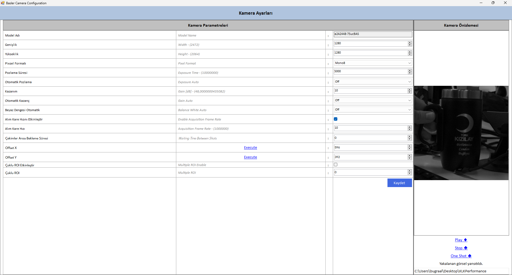
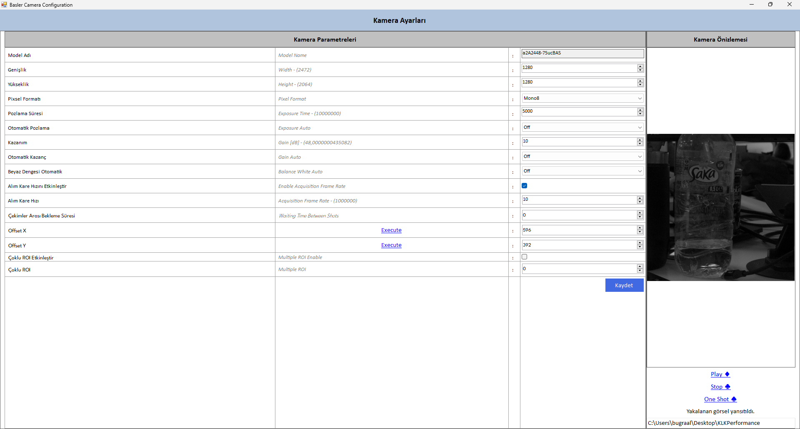
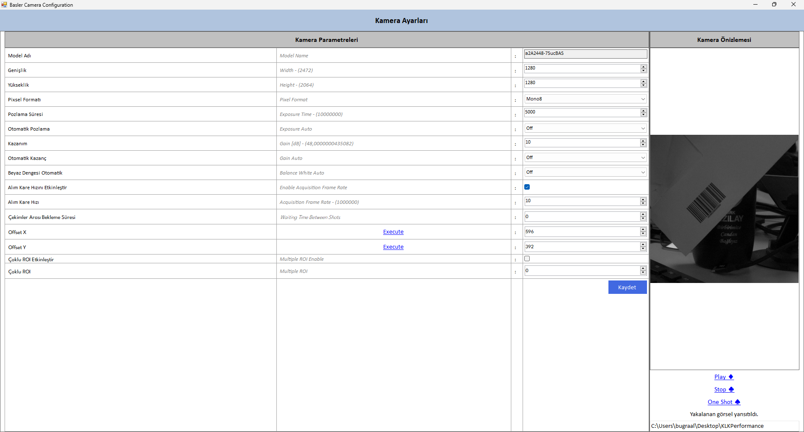
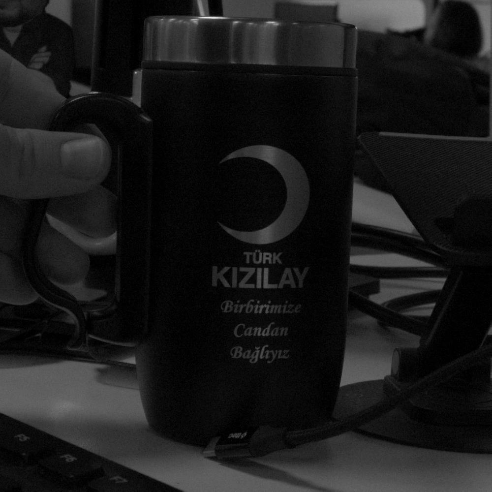
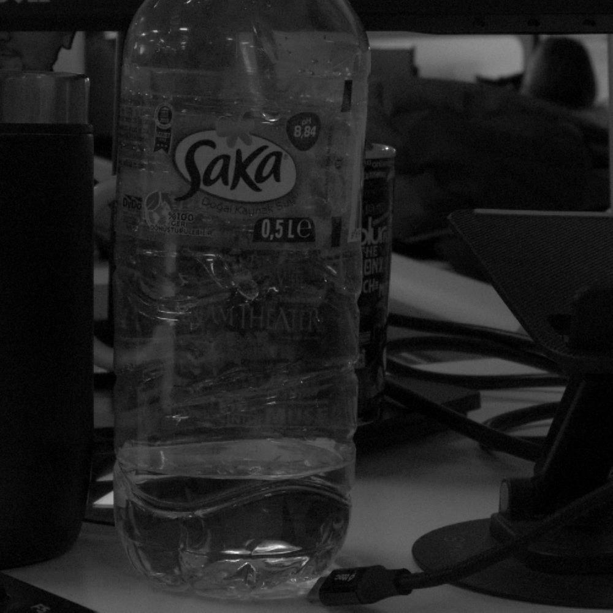

[](LICENSE)


# 📷 Basler A2A2448-75ucBAS Kamera Config Arayüzü

Bu proje, **Basler A2A2448-75ucBAS** model endüstriyel kameranın parametrelerini kolayca yönetmek için geliştirilmiş bir **konfigürasyon arayüzünü** içerir.  
Arayüz, kamera ayarlarının hızlıca düzenlenmesini ve test edilmesini sağlar.  

---

## 🚀 Özellikler

- **Kamera Bağlantısı**
  - USB 3.0 üzerinden otomatik kamera tespiti
  - Bağlantı durumunun canlı olarak takip edilmesi

- **Görüntü Alma**
  - Tek kare (single frame) veya sürekli (continuous) görüntü alma
  - Anlık görüntü önizlemesi

- **Temel Ayar Yönetimi**
  - Exposure Time (Pozlama süresi)
  - Gain (Kazanç)
  - White Balance (Beyaz dengesi)
  - Frame Rate (FPS)

- **Gelişmiş Parametreler**
  - Trigger Mode (Software / Hardware tetikleme)
  - Pixel Format seçimleri
  - ROI (Region of Interest) ayarları
  - Gamma, Brightness, Contrast kontrolleri

---

## 🖥️ Arayüz Görünümü

📌 Arayüz, kullanıcı dostu olacak şekilde tasarlanmıştır.  
Ana ekran üzerinden kamera bağlama, görüntü alma ve ayar yapma işlemleri tek tıkla gerçekleştirilebilir.  








## 🔧 Kurulum ve Çalıştırma

1. Bu projeyi bilgisayarına klonla:
   ```bash
   git clone https://github.com/alknbugra/BaslerCamera.git
